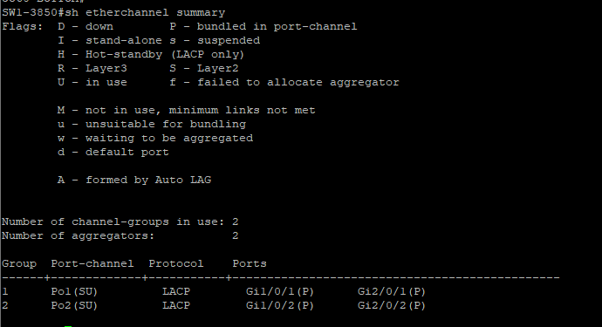
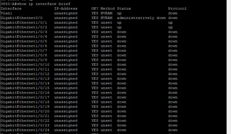
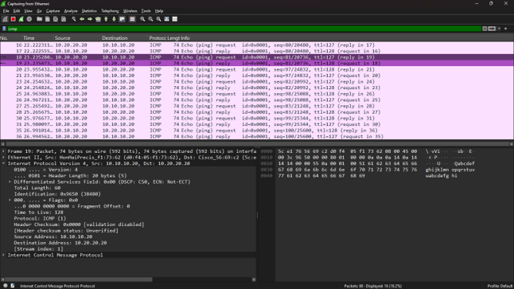

# Cisco 3850 Switch Stack — EtherChannel, Inter-VLAN Routing & SPAN Monitoring Lab

A hands-on lab building a resilient distribution layer using a **Cisco 3850 switch stack** (StackWise), **LACP EtherChannel** uplinks/downlinks, **inter-VLAN routing** on a 3560, and a **SPAN session** to monitor VLAN traffic live with Wireshark.

---

## 📌 Project Objective

Build a redundant, loop-free distribution layer where two 3850 switches operate as a single logical stack (Active/Standby), connect to the layer above and below via **LACP port-channels** instead of single links, route between VLAN 10 and VLAN 20 using SVIs, and **mirror live traffic** to a monitoring PC using a SPAN session — then verify everything with `show` commands, continuous pings, and a packet capture.

---

## 🖧 Network Topology


| Layer | Device | Role |
|---|---|---|
| Edge | Router | Gateway to ISP, static routes to VLAN 10/20 |
| Distribution | 3560 - TOP | Inter-VLAN routing (SVI), EtherChannel (Po1) down to the stack |
| Core / Stack | 3850-A & 3850-B | StackWise pair — 3850-A Active (master), 3850-B Standby |
| Monitoring | Monitor PC | SPAN destination, captures mirrored VLAN 10 traffic |
| Access | 3560 - BOTTOM | Access switch, EtherChannel (Po2) up to the stack |
| Endpoints | PC - VLAN 10 (10.10.10.20) / PC - VLAN 20 (10.20.20.20) | Test clients |

**Traffic flow:** ISP → Router → 3560-TOP → **Po1 (EtherChannel)** → 3850 Stack (Active/Standby) → **Po2 (EtherChannel)** → 3560-BOTTOM → VLAN 10 / VLAN 20 PCs, with VLAN 10 traffic mirrored to the Monitor PC via SPAN.

---

## 🔗 Stack Connectivity (3850-A + 3850-B)

Before any VLAN or routing config, the two 3850 units were physically cabled together using Cisco StackWise cables and verified as a single logical switch.


```
Switch#show switch stack-ports
Switch#  Port1  Port2
------------------------
1        OK     OK
2        OK     OK

Switch#show switch stack-ports summary
Sw#/Port#  Port Status  Neighbor  Cable Length  Link OK  Link Active  Sync OK  #Changes to LinkOK  In Loopback
1/1        OK           2         50cm          Yes      Yes          Yes      2                   No
1/2        OK           2         50cm          Yes      Yes          Yes      1                   No
2/1        OK           1         50cm          Yes      Yes          Yes      1                   No
2/2        OK           1         50cm          Yes      Yes          Yes      1                   No
```


Stack role and priority — 3850-A elected **Active**, 3850-B elected **Standby**:

```
SW1-3850#sh switch
Switch/Stack Mac Address : 9c57.ade0.9600 - Local Mac Address
Mac persistency wait time: Indefinite
                                    H/W    Current
Switch#  Role     Mac Address     Priority Version State
------------------------------------------------------------------
*1       Active   9c57.ade0.9600  15       V06      Ready
 2       Standby  44ad.d913.7980  14       V01      Ready
```

Stack priority was configured explicitly so 3850-A always wins the Active role on boot:

```
conf t
hostname SW1-3850
exit
switch 1 priority 15
switch 2 priority 14
show switch
show switch stack-ports
exit
```

---

## ⚙️ Configuration (in topology order)

### 1. Router — Gateway to ISP + static routes to VLANs

```
interface GigabitEthernet0/0
 ip address 172.18.2.9 255.255.255.252
 no shutdown

interface GigabitEthernet0/1
 ip address 192.168.1.1 255.255.255.252
 no shutdown

ip route 0.0.0.0 0.0.0.0 172.18.2.1
ip route 10.10.10.0 255.255.255.0 192.168.1.2
ip route 10.20.20.0 255.255.255.0 192.168.1.2
```

Verified with `show ip route` on the router — default route to the ISP, and static routes to both VLAN subnets via the 3560-TOP:


### 2. 3560-TOP — Inter-VLAN routing (SVI) + EtherChannel to the stack

```
conf t
hostname 3560-TOP
ip routing

vlan 10
 name DATA-MONITOR
exit
vlan 20
 name DATA-VLAN20
exit

interface GigabitEthernet0/1
 no switchport
 ip address 192.168.1.2 255.255.255.252
 no shutdown
exit

interface range GigabitEthernet0/2
 switchport mode trunk
 switchport trunk allowed vlan 10,20
 channel-group 1 mode active
 no shutdown
exit

interface range GigabitEthernet0/3
 switchport mode trunk
 switchport trunk allowed vlan 10,20
 channel-group 1 mode active
 no shutdown
exit

interface Port-channel1
 switchport mode trunk
 switchport trunk allowed vlan 10,20
exit

interface Vlan10
 ip address 10.10.10.1 255.255.255.0
 no shutdown
exit

interface Vlan20
 ip address 10.20.20.1 255.255.255.0
 no shutdown
exit

ip route 0.0.0.0 0.0.0.0 192.168.1.1
end
```

### 3. 3850 Stack — VLANs + LACP EtherChannels (Po1 uplink, Po2 downlink)

```
conf t
vlan 10
 name DATA-MONITOR
exit
vlan 20
 name DATA-VLAN20
exit

! Po1 - uplink to 3560-TOP
interface range GigabitEthernet1/0/1
 switchport mode trunk
 switchport trunk allowed vlan 10,20
 channel-group 1 mode active
 no shutdown
exit

interface range GigabitEthernet2/0/1
 switchport mode trunk
 switchport trunk allowed vlan 10,20
 channel-group 1 mode active
 no shutdown
exit

interface Port-channel1
 switchport mode trunk
 switchport trunk allowed vlan 10,20
exit

! Po2 - downlink to 3560-BOTTOM
interface range GigabitEthernet1/0/2
 switchport mode trunk
 switchport trunk allowed vlan 10,20
 channel-group 2 mode active
 no shutdown
exit

interface range GigabitEthernet2/0/2
 switchport mode trunk
 switchport trunk allowed vlan 10,20
 channel-group 2 mode active
 no shutdown
exit

interface Port-channel2
 switchport mode trunk
 switchport trunk allowed vlan 10,20
exit
```

Verified both port-channels bundled correctly via LACP:

```
SW1-3850#sh etherchannel summary
Flags: D - down    P - bundled in port-channel
       I - stand-alone  s - suspended
       ...
Number of channel-groups in use: 2
Number of aggregators:            2

Group  Port-channel  Protocol  Ports
-----+-------------+---------+-----------------------------------
1      Po1(SU)       LACP      Gi1/0/1(P)    Gi2/0/1(P)
2      Po2(SU)       LACP      Gi1/0/2(P)    Gi2/0/2(P)
```


Port-channel interfaces confirmed **up/up**:


Trunk state and allowed VLANs on both port-channels:

```
SW1-3850#sh int trunk
Port  Mode  Encapsulation  Status     Native vlan
Po1   on    802.1q         trunking   1
Po2   on    802.1q         trunking   1

Port  Vlans allowed on trunk
Po1   10,20
Po2   10,20
```


VLAN 10 and VLAN 20 active on the stack:


Routed interface / SVI status on the distribution switch:


### 4. SPAN Monitoring — mirror VLAN 10 traffic to the Monitor PC

Configured on 3850-A (the Active stack member) to capture all VLAN 10 traffic and forward it to a dedicated monitoring port:

```
interface GigabitEthernet1/0/10
 switchport mode access
 switchport access vlan 10
 no shutdown
exit

monitor session 1 source vlan 10
monitor session 1 destination interface GigabitEthernet1/0/10
```

Verified with `show monitor session 1`:

```
3850-A#show monitor session 1
Session 1
---------
Type              : Local Session
Source VLANs
    Both          : 10
Destination Ports  : Gi1/0/10
    Encapsulation  : Native
    Ingress        : Disabled
```


### 5. 3560-BOTTOM — Access switch, EtherChannel uplink + VLAN access ports

```
en
conf t
hostname 3560-BOTTOM

vlan 10
 name DATA-MONITOR
vlan 20
 name DATA-VLAN20

interface range GigabitEthernet0/1
 switchport mode trunk
 switchport trunk allowed vlan 10,20
 channel-group 2 mode active
 no shutdown
exit

interface range GigabitEthernet0/2
 switchport mode trunk
 switchport trunk allowed vlan 10,20
 channel-group 2 mode active
 no shutdown
exit

interface Port-channel2
 switchport mode trunk
 switchport trunk allowed vlan 10,20
exit

interface GigabitEthernet0/3
 switchport mode access
 switchport access vlan 10
 no shutdown
exit

interface GigabitEthernet0/4
 switchport mode access
 switchport access vlan 20
 no shutdown
end
```

---

## 🔬 Verification & Testing

### Lab bench — live capture and continuous pings running side by side


### Reachability — PC-VLAN10 to gateway
```
C:\Users\7480>ping 10.10.10.20 -t
Reply from 10.10.10.20: bytes=32 time=2ms TTL=127
...
Ping statistics for 10.10.10.20:
    Packets: Sent = 26, Received = 26, Lost = 0 (0% loss)
```


### Reachability — PC-VLAN20 to gateway
```
C:\Users\Pradeesh>ping 10.20.20.20 -t
Reply from 10.20.20.20: bytes=32 time=1ms TTL=127
...
Ping statistics for 10.20.20.20:
    Packets: Sent = 29, Received = 29, Lost = 0 (0% loss)
```


### Packet capture on the SPAN destination port
Wireshark on the Monitor PC captured live ICMP traffic between 10.10.10.20 and 10.20.20.20, confirming the SPAN session mirrors VLAN 10 traffic correctly:



### Full verification command reference

| Show Command | Purpose |
|---|---|
| `show etherchannel summary` | Confirm Po1/Po2 are up (SU/LACP) |
| `show interface trunk` | Confirm trunk state + allowed VLANs |
| `show vlan brief` | Confirm VLAN 10/20 exist and port membership |
| `show switch` | Confirm stack roles (3850-A = Active, 3850-B = Standby) |
| `show monitor session 1` | Confirm SPAN source/destination |
| `show ip interface brief` | Confirm SVI/routed interface status (3560-TOP) |
| `show ip route` | Confirm routes to VLAN 10/20 and default route |
| `ping 10.10.10.1` | From PC-VLAN10, test gateway reachability |
| `ping 10.20.20.1` | From PC-VLAN20, test gateway reachability |

---

## ✅ Results

- Built a **2-node Cisco 3850 StackWise cluster** with a confirmed Active/Standby role split.
- Configured **LACP EtherChannel** uplinks (Po1) and downlinks (Po2), verified both bundled and passing VLAN 10/20 trunk traffic.
- Configured **inter-VLAN routing** on the 3560-TOP distribution switch using SVIs for VLAN 10 and VLAN 20.
- Set up a **SPAN session** to mirror VLAN 10 traffic to a dedicated monitoring port and validated it live in Wireshark.
- Verified end-to-end reachability with continuous pings from both VLAN 10 and VLAN 20 clients — 0% packet loss on both.

---

## 🛠️ Skills Demonstrated

`Cisco Catalyst 3850` `StackWise` `LACP EtherChannel` `Inter-VLAN Routing (SVI)` `VLAN Trunking (802.1Q)` `SPAN / Port Mirroring` `Wireshark Packet Analysis` `Static Routing` `Network Troubleshooting` `ping / show commands`
